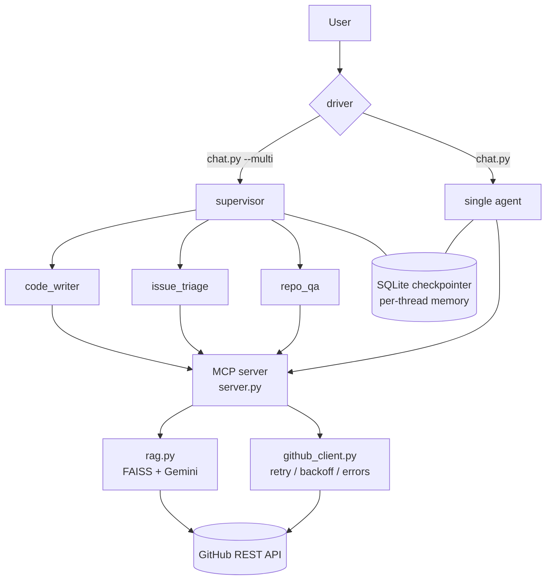

# GitHub Agent

A multi-agent GitHub assistant built on a [Model Context Protocol](https://modelcontextprotocol.io)
server. An MCP server exposes GitHub operations as tools; LangGraph agents
consume them to answer questions about repositories, search code semantically,
triage issues, and open pull requests — with a human approval gate on every
write.

Built as a learning / portfolio project to exercise a spread of applied-AI
concepts end to end.

## What it demonstrates

| Area | Concept | Where |
|---|---|---|
| Protocol | MCP server exposing 12 tools over stdio | `server.py` |
| Architecture | Separation of concerns: HTTP client vs tools vs agent wiring | `github_client.py` / `server.py` / `agent_core.py` |
| Resilience | Retry + exponential backoff + jitter, rate-limit handling, LLM-readable errors | `github_client.py` |
| Config | Validated, fail-fast settings; secrets masked | `config.py` |
| Memory | Per-conversation state via a SQLite checkpointer (`thread_id`) | `agent_core.py` |
| Context control | Summarization middleware keeps the window bounded | `agent_core.py` |
| Safety | Model-call limit, model-retry on bad tool calls | `agent_core.py` |
| RAG | Repo tarball → chunk → Gemini embeddings → FAISS → cited retrieval | `rag.py` |
| Human-in-the-loop | Graph interrupts before any state-changing GitHub call | `agent_core.py` / `chat.py` |
| Multi-agent | Supervisor delegates to `repo_qa` / `issue_triage` / `code_writer` specialists ("agent as tool") | `multi_agent.py` |
| Testing | 16 offline tests mocking the GitHub API at the HTTP boundary | `tests/` |
| Evaluation | Golden dataset + deterministic checks + LLM-as-judge, gated in CI; explicitly tests the hallucination failure mode | `evals/` |
| UI | Streamlit chat app; async agent bridged to Streamlit's sync/rerun model via a dedicated background-thread event loop and a queue-fed long-lived task | `streamlit_app.py` / `runner.py` |

## Architecture



## Tools on the MCP server

Read: `list_repo_files`, `read_file`, `list_issues`, `get_issue`,
`index_repo`, `search_code`
Write (gated): `create_issue`, `comment_on_issue`, `add_labels`,
`create_branch`, `write_file`, `open_pull_request`

## Setup

```bash
python -m venv venv
venv\Scripts\activate                 # Windows
pip install -e ".[dev,rag,ui]"

copy .env.example .env                 # then fill in tokens
```

`.env` needs `GITHUB_TOKEN` and `GROQ_API_KEY`; `GOOGLE_API_KEY` is required
for the RAG tools (Gemini embeddings). Writes are **off** by default — set
`ALLOW_WRITES=true` with a write-scoped token to enable them.

## Run

```bash
streamlit run streamlit_app.py         # web UI (chat + approval buttons)
python testClient.py                   # call the MCP server directly
python agent.py "question"             # one-shot, no memory
python chat.py                         # interactive, per-thread memory
python chat.py <thread_id>             # resume an earlier conversation
python chat.py --multi                 # supervisor + specialist team
python demo.py --list                  # scripted scenario tour
pytest -q                              # offline test suite
```

## Build log

- [x] Stage 1 — minimal MCP server
- [x] Stage 2 — ReAct agent wired to the server
- [x] Block A — hardened client, validated config, conversational memory
- [x] Block B — RAG over a repository (`index_repo`, `search_code`)
- [x] Block C — write tools + human-in-the-loop approval
- [x] Block D — multi-agent supervisor
- [x] Block E — demo CLI + docs
- [x] Streamlit UI — chat interface with in-browser approval buttons
- [x] Evaluation harness — golden set + LLM-as-judge + hallucination guard

## Evaluation

Beyond the offline unit tests (which prove the *plumbing* works), the
agent's *answers* are measured against a golden set in `evals/`:

```bash
python evals/run.py            # run every case, print a scored report
python evals/run.py --list     # list case ids
python evals/run.py rag-code-locator   # run one case
RUN_EVALS=1 pytest tests/test_evals.py # same, as a CI gate
```

Each case (`evals/cases.yaml`) is scored two ways, and passes only if
**both** agree:

- **Deterministic checks** — did it call the expected tool? does the
  answer contain (or crucially, *avoid*) specific strings? Cheap, exact.
- **LLM-as-judge** (`evals/judge.py`) — a separate model scores the
  answer 1–5 against a plain-English rubric, catching quality problems a
  substring match can't.

The set deliberately includes a **hallucination guard**: it asks for the
contents of a file that doesn't exist and *fails* the agent if it invents
any code instead of reporting "not found". Testing the failure mode
matters as much as testing the happy path.

`python evals/run.py` exits non-zero if any case fails, so it doubles as
a CI quality gate.

## Engineering note: bridging async agents into Streamlit

Streamlit reruns the whole script on every click and offers no async
support natively, but the agent's dependencies (an MCP subprocess over
stdio, an async SQLite checkpointer) both require the *same* asyncio task
to stay running for as long as they're used -- exactly how the CLI uses
them (`async with build_agent() as agent:` wrapping a whole multi-turn
session). A naive bridge that opens the agent in one `run_coroutine_threadsafe`
call and uses it in later, separate calls breaks silently: the SQLite
connection's worker thread gets torn down by Python's async-generator
finalizer once nothing references the context manager anymore, and the
MCP client's background reader dies once its opening task completes.
`runner.py`'s `AgentWorker` fixes this by holding the entire session
(construction + every message) inside **one** long-lived task, fed
through a queue -- callers from any thread submit work and block on a
`concurrent.futures.Future` for the result.

## Known limitations

- Groq's free tier is rate-limited (TPM/RPM); the multi-agent path makes
  several model calls per turn and can hit `429`s. `ModelRetryMiddleware`
  and the Groq SDK's own backoff absorb most of them.
- The FAISS index is local and per-repo under `vector_store/`; there is no
  incremental re-indexing yet.
- Long-term (cross-thread) memory via a LangGraph `Store` is scaffolded but
  not implemented.
